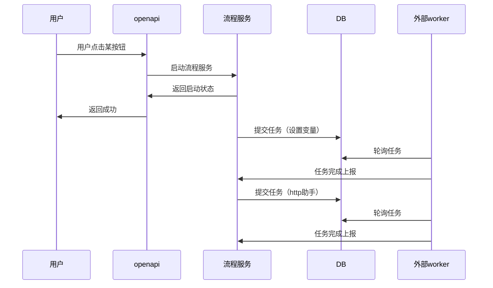

# 

```mermaid
sequenceDiagram
    participant 用户
    participant openapi
    participant 流程服务
    participant DB
    participant 外部worker
    
    用户 ->> openapi : 用户点击某按钮
    openapi ->> 流程服务 : 启动流程服务
    流程服务  ->> openapi : 返回启动状态
    openapi ->> 用户 : 返回成功
    流程服务  ->> DB : 提交任务（设置变量）
    外部worker ->> DB  : 轮询任务
    外部worker ->> 流程服务 : 任务完成上报
    流程服务  ->> DB : 提交任务（http助手）
    外部worker ->> DB  : 轮询任务
    外部worker ->> 流程服务 : 任务完成上报
    
```

